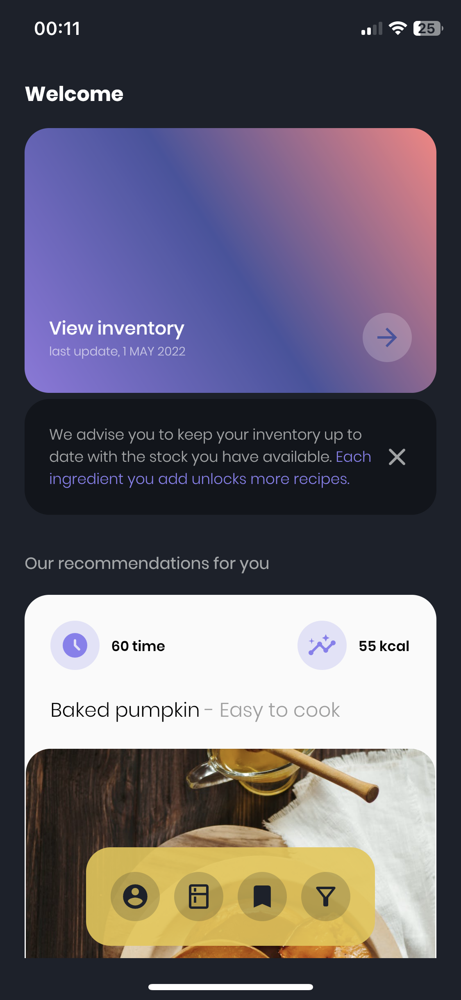
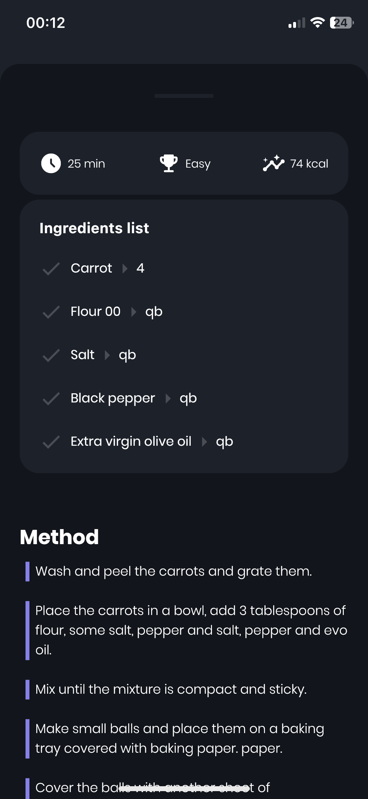
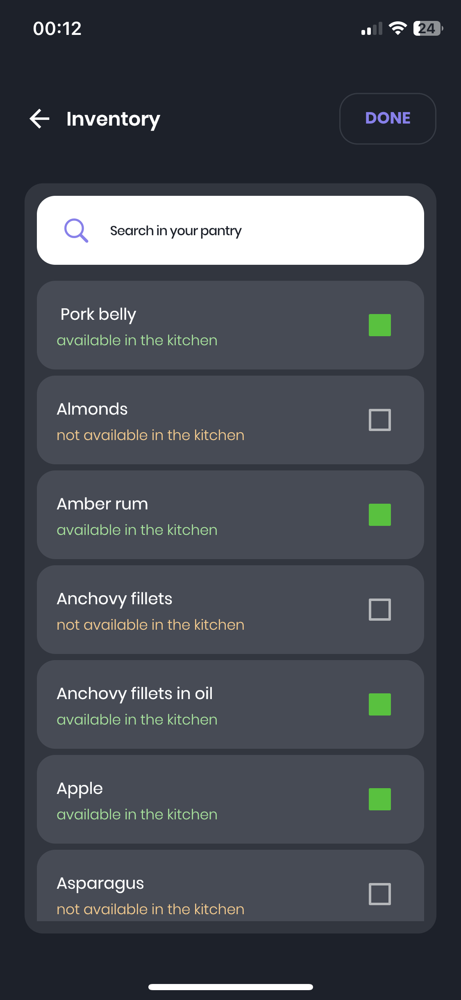
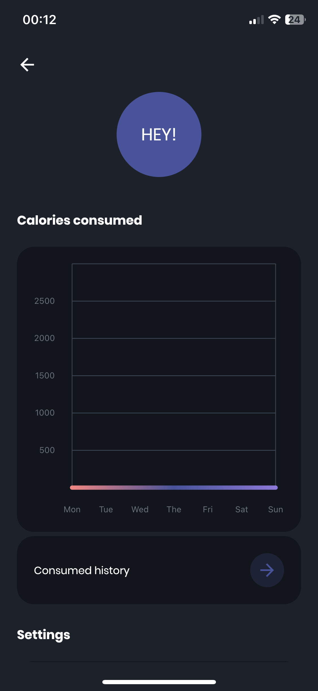

# FoodMatch

## Introduction

foodmatch is a mobile application that introduces even the less experienced to the world of cooking. Don't know what to cook? Don't know what to eat with your friends who come to visit you? Join us and we will take care of everything.

Below some presentation images.

  
  
  
  

### Development

First approach to mobile development with Flutter and [GetX](https://pub.dev/packages/get).

As Baas and for authentication this application uses [Firebase](https://firebase.google.com).

Before run project, execute this commands:

- `flutter clean`
- `flutter pub get`
- `flutter run` (if needed)

## Support

If you like my work and want to support give a ⭐ to the repo.

Thank you so much ❤️.

## License

This project is under MIT License. See [LICENSE](https://github.com/mitinoh/food_match/blob/main/LICENSE) for more details.
